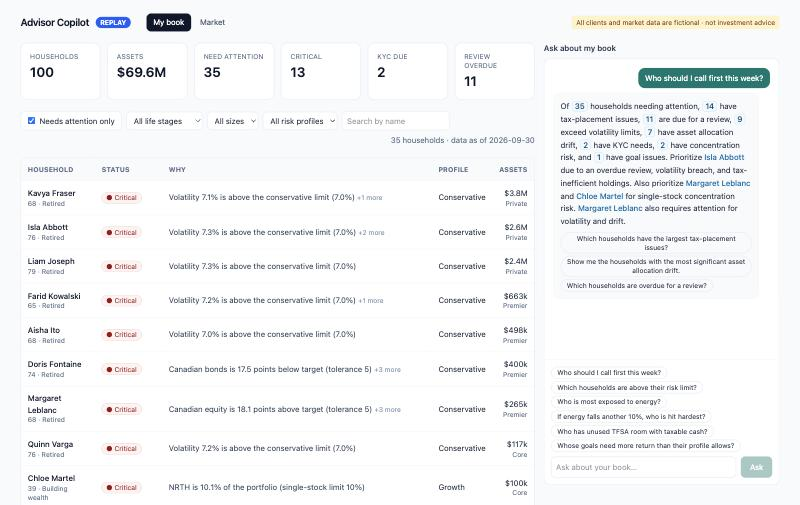

# Advisor Copilot

[](https://github.com/Sohee-sophiePark/advisor-copilot/actions/workflows/ci.yml)
**Live replay demo:** https://sohee-sophiepark.github.io/advisor-copilot/

Before every client review a wealth advisor stitches together allocation versus the model portfolio,
drift, risk and concentration, tax placement across TFSA/RRSP/RRIF and non-registered accounts, and
market context, then writes a recommendation that has to be *suitable* for the client's documented
KYC profile and defensible to compliance. Advisor Copilot is a multi-agent system that does that
prep with a hand-built agent harness: parallel read-only analysts, one writer, deterministic gates,
a separate evaluator in a bounded revision loop, and a human approval before anything happens.
Every number in the output is computed by code and traceable to the tool that produced it.

What the advisor sees:

- **My book** — 100 households, sorted by who needs attention first, with a one-line reason each
  (suitability or concentration breach, drift, tax placement, KYC due, review overdue).
- **Client** — the full picture: profile and life stage, goals from the client survey, holdings by
  account, drift against the target mix, volatility against the profile's limit, stress loss, notes.
- **Review & Ask** — a chat per client; past conversations can be reopened and continued. "Prepare annual review" produces a recommendation to approve;
  questions get short grounded answers; follow-ups reuse earlier findings; what-ifs ("sell half of
  NRTH into bonds?") are simulated by code with before-and-after numbers.
- **Market** — fictional index trends and the households most exposed to each.
- **Ask about my book** — a chat panel beside My book and Market for questions across all households: who to call
  first, segments, risk above the limit, exposure to a holding, a hypothetical market move, tax placement, goals.
  Every list and number comes from code; households appear as links to their page.

All clients, instruments and market data are fictional. Nothing here is investment advice.



## Architecture

```
 Advisor UI (React)                  FastAPI + SSE, one chat turn:
 My book · Client · Market           G0 input gate → G1 KYC gate (incomplete or >12 months) → Router
 Review & Ask (chat per client)        ├ out_of_scope → polite redirect                (no analysts)
        │ POST /threads/{id}/messages  ├ follow_up    → reuse findings from the thread  (no analysts)
        │ ◀── progress events ──       ├ what_if      → scenario analyst + trade simulator (code)
        │ POST /runs/{id}/approval     ├ targeted     → only the needed analysts, short answer
        ▼                              ├ full_review  → Portfolio │ Risk │ Tax │ Market in parallel
   CRM outbox (mock JSON)              └ book_question (book chat) → book analyst over seven book tools
                                                        ▼ structured findings + metric references
                                     Synthesizer (single writer, numbers only as {{m:key}})
                                       ▼ G5 deterministic output gates ──fail──┐
                                       ▼ Evaluator (recommendations only) ─────┘ revise, max 2
                                       ▼ AWAITING_APPROVAL (review) or answer (chat)
 Cross-cutting: LLMClient (Gemini | cassette | scripted) · rate limiter · budgets · caches · trace · SQLite
 Developer console (laptop only): runs, trace timeline, gates, evaluator verdicts, usage and cost
```

## Harness design decisions

Design decisions and the sources behind them:

- **Workflow first.** The pipeline shape is code. Models only route, analyse, write and judge.
- **Parallel readers, one writer.** Four analysts run with isolated context and return structured
  findings; only the synthesizer writes; only a human approval executes an action.
- **Code decides breaches.** Drift, concentration, suitability, tax-location and KYC severities come
  from pure functions with unit tests, never from a model.
- **Bounded loop with a separate evaluator.** Cheap deterministic gates run first, then an LLM
  evaluator with a rubric; code computes the verdict; two revisions at most, then
  `NEEDS_ADVISOR_REVIEW`. Nothing passes silently.
- **Defence in depth against prompt injection.** Untrusted text is wrapped, scanned and redacted,
  tools are read-only and bound to one client, output gates check for contradictions and echoes,
  and a human approves. The eval suite runs the injected-note scenario with redaction off to prove
  the other layers hold.
- **No agent framework.** The loop, limiter, budget, trace and checkpoints are our own Python behind a
  provider-agnostic `LLMClient`; Gemini is one adapter. Sources: Anthropic's *Building effective agents*,
  *Multi-agent research system* and *Demystifying evals*; Cognition's *Don't build multi-agents*; OWASP LLM01.
- **Replay first.** Every run is recorded; CI and the public demo replay recordings and need no key.
- **Cost controls.** Preset fast path, follow-ups answered from earlier findings, cached findings and
  answers when data is unchanged, single-call analysts for chat answers, evaluator only for
  recommendations, output-token caps, a per-conversation budget and a daily call cap per model.

## How numbers stay correct

Tools return `Metric(key, value, unit, label, source_tool)`. The models see the values but may only
cite them as `{{m:<key>}}`. Gate G4 rejects analyst findings and gate G5.2 rejects any draft with a
digit outside a placeholder; the renderer fills placeholders from the metric dictionary and the UI
shows each value as a chip whose tooltip names the metric key, the tool and the raw value. Book answers name
households only as `{{h:<client_id>}}`; gate G5.13 rejects any id the tools did not return and any bare name. Unit
tests compare every tool against pre-computed golden values in `tests/fixtures/expected_values.json`.

## Evaluation

Three tiers: unit tests, scenario regression on
recorded cassettes, and a live capability tier with pass^3 and a judge calibrated on human labels.
`make eval` writes [evals/reports/latest.md](evals/reports/latest.md); the current run is 22/22
golden cases on 183 unit tests, replaying real Gemini recordings. The data includes 15 edge-case
households, one per rule boundary (for example a single stock at 9.9% and at 10.1%), each with a test. Tiers 1 and 2 run in CI on every push with no key.

## Run it

```bash
make setup                       # uv sync + npm install
make seed                        # build the local SQLite database from the synthetic data
RUN_MODE=replay make dev         # API + UI from recorded cassettes, no key needed
```

Live mode needs a Gemini API key (free tier is enough): copy `.env.example` to `.env`, fill it in,
then `set -a; . ./.env; set +a` in your shell before `make smoke`, `make dev`, `make record` or
`make eval-live`. The API binds `127.0.0.1` on the first free port in the range configured under
`api` in `config/settings.yaml`; the UI dev server proxies `/api` to it.

| Target | What it does |
|---|---|
| `make test` / `make lint` | pytest and ruff |
| `make eval` | tiers 1 and 2 against cassettes, report to `evals/reports/latest.md` |
| `make eval-live` | tier 3: live runs × k, judge calibration, report to `evals/reports/live_<date>.md` |
| `make record` | run every scenario live, write `cassettes/` and `replays/` |
| `make build-static` | replay-only web build for GitHub Pages (`VITE_STATIC=1`) |
| `uv run advisor-copilot tools C002` | metrics and flags for a client, no LLM |
| `make dev`, then `/dev.html` | developer console, served only by the local dev server |

## Security notes

No secrets in the repository; the key is read from the environment at call time and a test fails
if key-shaped material appears in any tracked file. The API binds loopback only, accepts only local Host names
(against DNS rebinding), validates every id
in a URL before it becomes a file path, limits CORS to the dev UI, and runs the full pipeline
without any model call when KYC is incomplete. Full prompts and tool results are written under
`runs/` (git-ignored) for audit.

## Mapping to Agentforce

Analysts map to topics with a small action set, the deterministic tools to Apex or Flow actions over
Financial Services Cloud data, metric placeholders to grounding in record data, the gates and evaluator
to guardrails plus agent test suites, and the approval step to a confirmation before a Task or Note is
created. The harness concepts carry over; the plumbing is the platform's.

## Disclaimer

Fictional clients, instruments, prices and market data; simplified educational tax rules;
illustrative capital-market assumptions. Not investment advice. Built with Claude Code.
